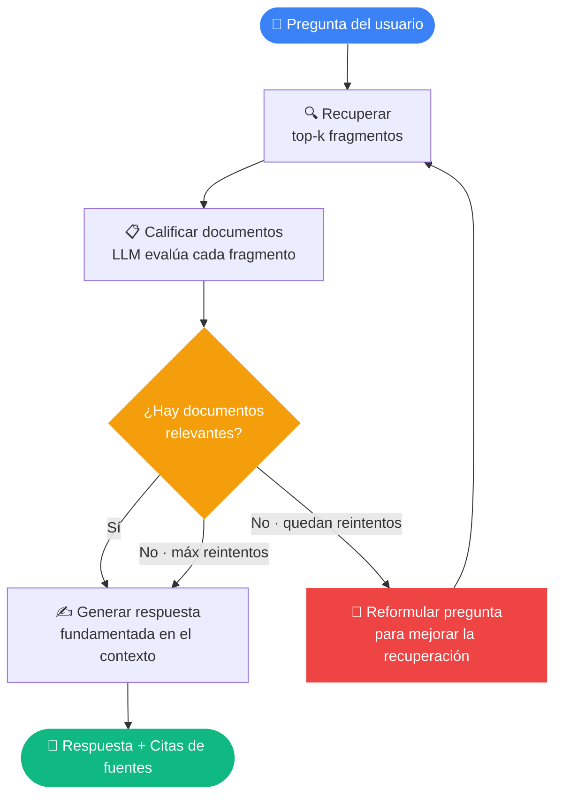

<div align="center">

# 📚 DocuMentor

### Asistente RAG Agéntico — Conversá con tus documentos usando IA con autocorrección

[](#)
[](https://fastapi.tiangolo.com)
[](#)
[](#)
[](#)
[](#-docker)
[](#-licencia)

</div>


---

## 🧠 ¿Qué es DocuMentor?

**DocuMentor** es un sistema **RAG Agéntico** de nivel producción que te permite conversar con cualquier corpus de documentos PDF. A diferencia de un pipeline RAG básico — que recupera fragmentos a ciegas y espera que alcance — DocuMentor usa un **grafo de estados agéntico** (construido con LangGraph) que:

1. **Recupera** los fragmentos semánticamente más similares de tus documentos.
2. **Califica** cada fragmento por relevancia usando un LLM como juez.
3. **Reformula** la pregunta y reintenta si la recuperación fue pobre.
4. **Genera** una respuesta fundamentada en el contexto que sobrevivió el filtro, con citas de fuentes.

El resultado es un sistema que se autocorrige antes de responder — la arquitectura que reemplazó al RAG ingenuo en entornos de producción.

---

## ✨ Funcionalidades

- 🔍 **Búsqueda semántica** — encuentra contenido relevante por significado, no por coincidencia de palabras
- 🤖 **Autocorrección agéntica** — evalúa los fragmentos recuperados y reformula la pregunta si los resultados son pobres
- 📄 **Citado de fuentes** — cada respuesta referencia el archivo de origen y el número de página
- 🔌 **Motor de LLM intercambiable** — alterná entre Ollama (gratis/local), OpenAI o Anthropic con una sola variable de entorno
- ⚡ **Backend FastAPI** con documentación Swagger/OpenAPI autogenerada en `/docs`
- 💬 **Interfaz de chat con Streamlit** e historial de conversación
- 🐳 **Completamente containerizado** — Docker + Docker Compose para despliegues reproducibles
- 📊 **Evaluado** — sistema de evaluación LLM-as-judge con golden set y puntaje numérico de calidad

---

## 🏗️ Arquitectura

El diseño central reemplaza la cadena lineal clásica `recuperar → generar` por una **máquina de estados** capaz de iterar, evaluar y recuperarse de recuperaciones fallidas.



### Nodos del grafo

| Nodo | Responsabilidad |
|---|---|
| **Recuperar** | Búsqueda por similitud semántica; devuelve los top-k fragmentos más parecidos |
| **Calificar documentos** | Un LLM clasifica cada fragmento como relevante o no; los irrelevantes se descartan |
| **Reformular pregunta** | Si no sobreviven fragmentos relevantes, un LLM reescribe la pregunta para mejorar la recuperación |
| **Generar** | Ensambla el contexto filtrado y produce una respuesta fundamentada y citada |

---

## 🛠️ Stack tecnológico

| Capa | Herramienta | Por qué |
|---|---|---|
| **Orquestación** | LangChain + LangGraph | Framework estándar para flujos LLM agénticos |
| **Base vectorial** | ChromaDB | Local, sin configuración, persistencia compatible con OCI |
| **Embeddings** | nomic-embed-text · text-embedding-3-small | Local gratuito o por API, intercambiable |
| **LLM** | Llama 3.1 (Ollama) · GPT-4o-mini · Claude | Agnóstico al motor vía patrón factory |
| **API** | FastAPI + Uvicorn | Asíncrono, tipado, autodocumentado |
| **Interfaz** | Streamlit | Chat rápido con estado de sesión |
| **Contenedores** | Docker + Docker Compose | Empaquetado reproducible y listo para deploy |
| **Evaluación** | LLM-as-judge | Medición de calidad escalable sin etiquetado manual |

---

## 📁 Estructura del proyecto

<details>
<summary>Expandir</summary>

```
documentor/
├── data/               # Colocá acá tus archivos PDF
├── chroma_db/          # Base vectorial autogenerada (ignorada por git)
│
├── config.py           # Factory de LLM y embeddings — un archivo para cambiar el motor
├── ingest.py           # Cargar → fragmentar → vectorizar → persistir
├── agent.py            # Máquina de estados agéntica con LangGraph
├── app.py              # Interfaz de chat con Streamlit
├── api.py              # Backend REST con FastAPI
├── evaluate.py         # Sistema de evaluación LLM-as-judge
│
├── Dockerfile
├── compose.yaml
├── requirements.txt
└── .env.example        # Copiá a .env y completá tus claves
```

</details>

---

## 🚀 Inicio rápido

### Requisitos previos

- Python 3.11+
- Tus archivos PDF colocados en `data/`

### Opción A — Gratis y local (Ollama)

Sin claves de API, sin costo, todo corre en tu máquina.

```bash
# 1. Instalá Ollama desde ollama.com y descargá los modelos necesarios
ollama pull llama3.1
ollama pull nomic-embed-text

# 2. Cloná el repo y configurá el entorno
git clone https://github.com/medinamarco/documentor.git
cd documentor
python -m venv venv
source venv/bin/activate        # Windows: venv\Scripts\activate
pip install -r requirements.txt

# 3. Ingerí tus documentos (ejecutar una vez, o cada vez que agregues PDFs)
python ingest.py

# 4a. Levantá la interfaz de chat
streamlit run app.py

# 4b. O levantá la API REST
uvicorn api:app --reload
# → Documentación interactiva en http://localhost:8000/docs
```

### Opción B — Motor por API (OpenAI / Anthropic)

```bash
cp .env.example .env
# Editá .env:
# ENGINE=openai
# OPENAI_API_KEY=sk-...

python ingest.py
streamlit run app.py
```

---

## 🐳 Docker

Ideal para despliegues consistentes y reproducibles.

```bash
# Configurá tu clave en .env y luego:
docker compose up -d --build

# La API queda disponible en:
# http://localhost:8000/docs  ← Swagger UI
# http://localhost:8000/ask   ← Endpoint POST

# Comandos útiles
docker compose logs -f          # seguir los logs en vivo
docker compose down             # frenar y limpiar
```

El `compose.yaml` lee tu archivo `.env` automáticamente — sin configuración extra.

---

## ⚙️ Configuración

Toda la configuración vive en `.env` (copiá desde `.env.example`):

| Variable | Default | Opciones |
|---|---|---|
| `ENGINE` | `ollama` | `ollama` · `openai` · `anthropic` |
| `OPENAI_API_KEY` | — | Requerida cuando `ENGINE=openai` |
| `ANTHROPIC_API_KEY` | — | Requerida cuando `ENGINE=anthropic` |

El cambio de motor es manejado por `config.py`, que expone las funciones factory `get_llm()` y `get_embeddings()`. Cambiar el motor no requiere ninguna modificación al código del pipeline.

---

## 📊 Evaluación

`evaluate.py` incluye un sistema liviano de medición de calidad:

1. Corre un **golden set de preguntas** contra el agente en vivo.
2. Usa un LLM juez separado para calificar cada respuesta del **1 al 5** en fidelidad y relevancia.
3. Reporta un puntaje de calidad agregado.

```bash
python evaluate.py
```

```
[5/5] ¿De qué tratan los documentos?
[4/5] ¿Cuál es la metodología utilizada?
[5/5] ¿Cuáles son las conclusiones principales?

📊 Puntaje promedio: 4.67 / 5
```

> Para evaluación a escala en producción, ver [RAGAS](https://docs.ragas.io) y [LangSmith](https://smith.langchain.com).

---

## 🧠 Decisiones de diseño

**¿Por qué LangGraph en vez de una cadena de LangChain?**
Una cadena lineal no tiene camino de recuperación. Si la recuperación devuelve fragmentos irrelevantes, el modelo alucina o se rinde. Las aristas condicionales y el soporte de bucles de LangGraph agregan toma de decisiones real: el grafo evalúa los fragmentos recuperados y, si fallan el test de relevancia, reformula la pregunta y reintenta hasta `MAX_RETRIES` veces. Esa es la diferencia entre un script frágil y un sistema robusto.

**¿Por qué fragmentar en 1 000 caracteres con 150 de solapamiento?**
Los fragmentos chicos mejoran la precisión de recuperación (menos ruido por resultado) pero arriesgan cortar ideas en el límite. Los 150 caracteres de solapamiento aseguran que oraciones cortadas en un límite aparezcan completas en al menos un fragmento. `RecursiveCharacterTextSplitter` respeta la estructura de párrafos y oraciones antes de caer a cortes a nivel de caracteres, preservando la coherencia semántica.

**¿Por qué el patrón factory en `config.py`?**
Escribir `ChatOpenAI(...)` por todo el código hace que los tests sean caros y las migraciones de motor, dolorosas. Centralizar la construcción de modelos en dos funciones factory (`get_llm`, `get_embeddings`) significa que cambiar de Ollama a GPT-4o-mini es un cambio de una línea en `.env`, sin ninguna modificación al pipeline.

**¿Por qué salida estructurada para el calificador de documentos?**
`llm.with_structured_output(GradeDocument)` fuerza una clasificación binaria estricta (`"si"/"no"`) del LLM calificador. Esto elimina el parseo frágil de strings y hace que la arista condicional del grafo sea determinista y testeable.

---

## 🗺️ Próximos pasos

- [ ] Búsqueda híbrida — combinar BM25 con búsqueda semántica para mejor recuperación
- [ ] Nodo calificador de alucinaciones — verificar fundamentación post-generación antes de responder
- [ ] Respuestas en streaming en la interfaz de Streamlit
- [ ] Integración de reranker (Cohere / cross-encoder local) para recuperación de mayor precisión
- [ ] Consultas comparativas entre múltiples documentos

---

## 📄 Licencia

MIT © [Marco Medina](https://medinamarco.github.io)

---

<div align="center">

Desarrollado por [Marco Medina](https://medinamarco.github.io) &nbsp;·&nbsp; [Portafolio](https://medinamarco.github.io) &nbsp;·&nbsp; [LinkedIn](https://linkedin.com/in/tu-perfil)

</div>
